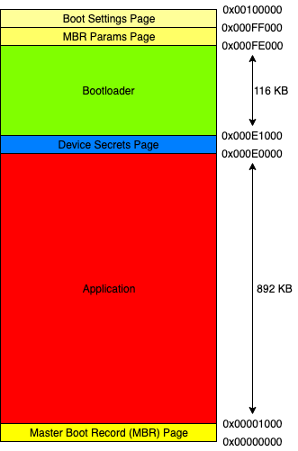
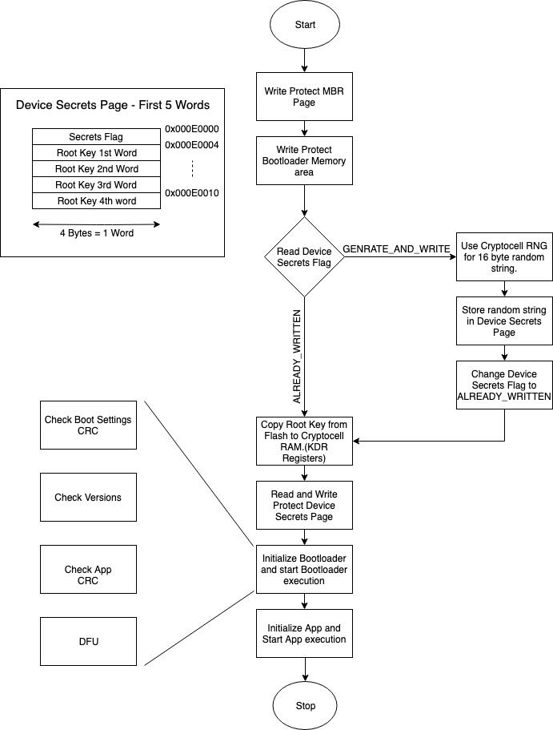

## NRF52840 Secure Bootloader

NRF52840's cryptocell implementation provides different accelerators for crypto operations like SHA-2, Random Number Generation, Elliptic Curve Multiplication etc. although it does not provide resources or machanisms for handling keys and other device secrets. Due to this drawback and for obvious reasons NRF52840 must be equipped with a secure bootloader that handles device secrets along with Device Firmware Upgrades(DFU).

> The current version of the bootloader supports firmware upgrades via USB. Every update must be signed and versioned properly. The DFU process and firmware signing process is best explained [here](https://infocenter.nordicsemi.com/index.jsp?topic=%2Fcom.nordic.infocenter.sdk5.v15.0.0%2Flib_bootloader_modules.html). (more on versioning below)

#### Memory mapping and Device Secrets


The current version of the bootloader provides two options for device secrets either you can generate your own key and burn it into the device secrets region or a random key can be generated for you. The choice is determined by the first word in the device secrets page whcih is the device secrets flag. When the flag is set to `1` it indicates that the key has been already written into the device secrets page and when it is set to `2` it indicates that a key must be generated and stored onto the flash.

**NOTE:** *If you are generating your own root key then make sure you burn the key starting from address 0x000E0004. Do not overwrite the flag -> will cause the bootloader to stall.*

```
file: secure.h

#define ALREADY_WRITTEN 0x00000001
#define GENERATE_AND_WRITE 0x00000002

file: secure.c

/*
* Available Options:
* 1. Device Secret is already on flash at 0x000E0000 - ALREADY_WRITTEN
* 2. Device Secret must be generated and written on flash - GENERATE_AND_WRITE
*/
const uint32_t private_key_option __attribute__((section(".device_secrets"))) __attribute__((used)) = GENERATE_AND_WRITE;
```

#### Boot Sequence


The bootloader before intializing write protects the Master Boot Record(MBR) and the Bootloader. Although before protecting the Device Secrets Page it copies the key into the secure RAM of the cryptocell. The cryptocell, technically, does not have any isolated flash or RAM, it has **four 32-bit registers (KDR Registers)** that are referred to as secure RAM. The LCS register is set such that the KDR registers can be written into only once ensuring better security. After the key has been copied the Device Secrets Page is completely protected from reading and writing.

#### Debugger Access
To increase the security of applications running on the nrf52840 this secure boot implementation completely blocks debugger access to the microcontroller. This is done directly when the bootloader is flashed onto the device.

```
file: secure.c

/*
* Set the read back protection using Control Access Ports. By specifying it as
* an "section" we can reference it in our linkerscript and write into the
* register while flashing the hardware.
* Available Options:
* 1. ALLOW_DEBUGGER_ACCESS
* 2. DISALLOW_DEBUGGER_ACCESS
*/
const uint32_t approtect_set __attribute__((section(".ctrlap"))) __attribute__((used)) = DISALLOW_DEBUGGER_ACCESS;
```

#### Versioning
The bootloader saves the versions of itself and the application in the Boot Settings Page. This is done to prevent downgrading attacks during the firmware upgrade process. The DFU(Device Firmware Upgrade) feature of the bootloader only accepts a new update if the signed version is greater than the current version. This means that firmware updates must follow proper versioning of application and bootloaders.

**NOTE:** *`nrfutil` only accepts integer values as versions of bootloader. Therefore each version type is assigned two digits of an integer i.e. `000100` menas `00.01.00` or `0.1.0`. Although the leading zeroes are removed, so it becomes `100` for `0.1.0`*

#### Flashing the Bootloader on nrf52840 Dongle

1. Make sure you have downloaded necessary tools and the SDK. You can follow the instructions [here](https://git.slock.it/hardware/crypto-accelerator-benchmarks#pre-requisites)
2. Make sure the device is connected via the J-Link debugger and that the OS can recognize it.
3. Create a environment variable that points to the nRF5 SDK folder. `export SDK_ROOT=<PATH_TO_YOUR_SDK_FOLDER>`
4. Build all the source files using the command: `make`
5. Flash the `.hex` file onto to the device via `make flash`. This step also generates a settings page with bootloader version as 100.
6. If the Red LED on the device is blinking then the bootloader flash process was successfull and the device booted directly into the DFU mode becuase there is no application present.
